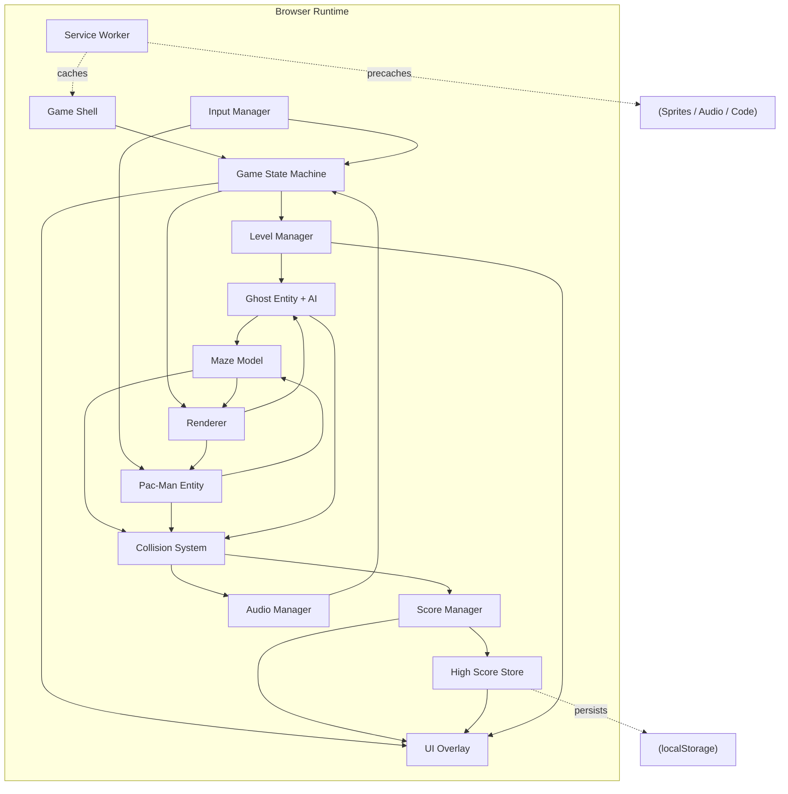

# Architect Mission Report

**Agent**: architect  
**Generated**: 2026-08-17T16:56:31.623Z

---

## Architecture Style

Client-side single-page application (modular monolith) with an in-browser event-driven game loop — no backend service required; all state is client-resident and persisted via Web Storage.

## Components

- **Game Shell** (bootstrap): Entry point that wires up the canvas, all managers (input, audio, score, renderer), and starts the requestAnimationFrame loop.
- **Game State Machine** (service): Owns the top-level screen flow: Start, Countdown, Playing, Paused, LevelComplete, GameOver. Drives which subsystems update/render each frame.
- **Maze Model** (domain-model): Static tile grid describing walls, corridors, dot/pellet positions, tunnel openings, and the ghost house bounding box. Tracks remaining dots for level-complete detection.
- **Pac-Man Entity** (domain-model): Tracks Pac-Man's position, facing direction, queued direction, chomp animation frame, and applies movement against the maze grid each tick.
- **Ghost Entity + AI** (domain-model): Four ghost instances each with a personality-specific targeting function (chase-direct, ambush-ahead, flank, wildcard) and a shared state machine (Chase/Scatter/Frightened/Eaten). Consumes level-driven timers for chase/scatter switching and frightened duration.
- **Collision System** (service): Tile-based overlap checks: Pac-Man vs dots/pellets/fruit, Pac-Man vs ghosts (by state), tunnel wrap-around logic.
- **Level Manager** (service): Owns level number, difficulty curve (ghost speed, frightened duration, chase/scatter ratios) capped at 20 levels then repeating, bonus fruit spawn triggers at 70/170 dots eaten, and fruit type/value table.
- **Score Manager** (service): Tracks current score, lives, extra-life threshold (10,000 pts), and escalating ghost-eat combo (200/400/800/1600). Emits events for HUD updates and extra-life audio cue.
- **High Score Store** (storage-adapter): Persists top-10 high score list (initials + score) across sessions using localStorage; exposes read/insert/qualifies-for-list checks.
- **Input Manager** (service): Normalizes keyboard (Arrow/WASD), touch swipe, and on-screen directional buttons into a single directional-intent stream; also handles pause and mute key bindings.
- **Renderer** (ui): Draws the maze, entities, and animations on an HTML5 Canvas at 60 FPS; applies colorblind-friendly palette swap when enabled.
- **UI Overlay** (ui): Accessible DOM overlay (not canvas) for Start/Countdown/Pause/LevelComplete/GameOver screens, HUD (score, high score, lives), mute button, and colorblind toggle. Keyboard-navigable with visible focus states.
- **Audio Manager** (service): Plays SFX (dot, pellet, ghost-eat, death, fruit, extra-life, startup jingle) and a looping background siren whose pitch/tempo scales with remaining dots; global mute toggle.
- **Service Worker** (infra): Precaches all game assets (code, sprites, audio) on first load to enable offline play and fast repeat loads, kept under the 2 MB budget.

## Tech Stack

- **frontend**: TypeScript + HTML5 Canvas 2D (vanilla, no UI framework) — A single-screen arcade game with an imperative 60 FPS render loop doesn't benefit from a virtual-DOM framework's diffing overhead; vanilla Canvas keeps the bundle small (helps the <2MB budget) and gives full control over frame timing. Phaser is a capable alternative but adds ~1MB+ of engine code for features (physics, tilemaps, scene graph) this game doesn't need — TypeScript's type safety covers the game-logic complexity without the extra weight.
- **build tool**: Vite — Vite provides fast dev-server HMR and produces small, tree-shaken ES module bundles out of the box, and has first-class PWA tooling (vite-plugin-pwa) for the offline requirement. Webpack requires more configuration to reach the same bundle size discipline; Parcel's zero-config approach is fine but has a smaller plugin ecosystem for PWA/service-worker generation.
- **audio**: Web Audio API — The siren's pitch/tempo must scale continuously with remaining dots — Web Audio API's native playbackRate/gain control gives sample-accurate, low-latency control needed for that effect and for overlapping SFX (dot-eat can fire rapidly). Howler.js is a thin wrapper over the same API and adds a dependency for little gain; raw <audio> elements have poor latency and can't easily pitch-shift a loop.
- **state/persistence**: Web Storage API (localStorage) — The only durable data is a top-10 high score list — a small, synchronous, key-value read/write is all that's needed. IndexedDB adds async complexity with no benefit at this data size; a backend+DB would require hosting, auth, and network dependency, which directly violates the offline-play requirement.
- **backend**: None (fully static client app) — No requirement calls for multi-user data, matchmaking, or server-authoritative logic; a backend would add hosting cost, latency, and an offline-capability contradiction for zero functional benefit. Revisit only if a global online leaderboard is added later.
- **auth**: None required — There are no user accounts — high scores are local to the device/browser. Adding auth would be pure over-engineering for a single-player offline game.
- **messaging/events**: Native EventTarget / CustomEvent bus — In-browser pub/sub between Score Manager, Audio Manager, and UI Overlay only needs a handful of event types; the browser's built-in EventTarget avoids any extra dependency weight. RxJS is powerful but overkill for this event volume; mitt is tiny but still an unneeded dependency when the native API suffices.
- **offline/PWA**: vite-plugin-pwa (Workbox-generated Service Worker) — Workbox-based generation via the Vite plugin reliably precaches the asset manifest (satisfying the offline-after-first-load requirement) with far less risk of cache-invalidation bugs than a hand-rolled service worker, and integrates directly with the chosen Vite build.
- **testing (unit/logic)**: Vitest — Vitest shares Vite's config and transform pipeline (fast, zero extra webpack/babel setup) and is used to unit-test ghost AI targeting functions, collision detection, scoring math, and level difficulty curves in isolation from rendering. Jest works but needs separate ts-jest/babel config; Mocha+Chai requires assembling more pieces for equivalent DX.
- **testing (e2e)**: Playwright — Playwright can simulate keyboard input and touch/swipe gestures across Chromium/Firefox/WebKit in one test run, directly validating the cross-browser and control-scheme requirements. Cypress has weaker multi-browser/touch-emulation support out of the box.
- **CI/CD**: GitHub Actions — Runs `npm ci`, `vitest run`, `playwright test`, and `vite build` on every push with zero infra to manage, and publishes the static `dist/` output directly to GitHub Pages/Netlify — matching the project's fully static deployment model. GitLab CI/CircleCI are equally capable but add setup overhead with no advantage for a repo already hosted on GitHub.
- **hosting/infra**: Static hosting (Netlify/GitHub Pages/Vercel static) — The build output is static HTML/JS/CSS/assets — a CDN-backed static host gives global low-latency delivery with zero server maintenance. A container or orchestrator would add operational complexity (deploys, scaling, health checks) this single-player client-only game never needs.
- **database**: None — client-side localStorage only — There is no server-side data to model; a relational database would require a backend and network dependency that contradicts the offline requirement and the game's single-player, single-device scope.

## Epics

- **EPIC-001** Maze Rendering & Layout: Define and render the maze grid (walls, corridors, dots, 4 power pellets, tunnel wrap on left/right, central ghost house) and scale it responsively from 375px to 2560px viewports.
- **EPIC-002** Pac-Man Movement & Input: Implement continuous grid-based movement, direction queueing, wall collision stopping, chomp animation, and unified input handling for keyboard (Arrow/WASD), swipe, and on-screen buttons.
- **EPIC-003** Ghost AI & Behavior States: Implement the four distinct ghost personalities (direct chase, ambush-ahead, flank, wildcard/random), the Chase/Scatter timer-driven alternation, and ghost-house release sequencing with per-ghost delays.
- **EPIC-004** Power Pellets & Ghost Vulnerability: Handle power-pellet consumption triggering ghost Frightened state (color change, reversed direction, slowdown, flashing warning in final 2s), eaten-ghost eyes returning to the ghost house and regenerating, and escalating 200/400/800/1600 combo scoring.
- **EPIC-005** Scoring, Lives & Extra Life: Track dot/pellet/fruit/ghost scoring, current + all-time high score HUD, 3 starting lives, death handling/reset with dots preserved, and extra life awarded at 10,000 points.
- **EPIC-006** Bonus Fruit: Spawn level-specific bonus fruit near maze center after ~70 and ~170 dots eaten, with per-level fruit type/point table and auto-despawn if not collected in time.
- **EPIC-007** Levels & Difficulty Progression: Detect level completion (all dots/pellets eaten), progress through 20+ levels of increasing ghost speed / shorter frightened duration / more chase-time, capping difficulty at level 20 and repeating thereafter.
- **EPIC-008** Screens & Game Flow: Implement Start, Countdown (3-2-1-GO), Playing, Pause (freeze + message), Level Complete transition, and Game Over screens with initials entry for qualifying high scores and a restart path.
- **EPIC-009** Audio System: Implement all SFX (dot, pellet, ghost-eat, death, fruit, extra-life, startup jingle), a looping background siren with dot-remaining-driven pitch/tempo scaling, and a global mute toggle.
- **EPIC-010** High Score Persistence: Maintain a top-10 high score list with 3-letter initials entry, persisted across browser sessions via localStorage.
- **EPIC-011** Accessibility & Colorblind Mode: Ensure full keyboard operability of all menus with visible focus indicators, and provide a colorblind-friendly ghost color palette toggle.
- **EPIC-012** Performance & Offline (PWA): Keep total asset payload under 2MB, sustain 60 FPS across target devices, and enable full offline play after first load via Service Worker asset precaching.

## Architecture Diagram

