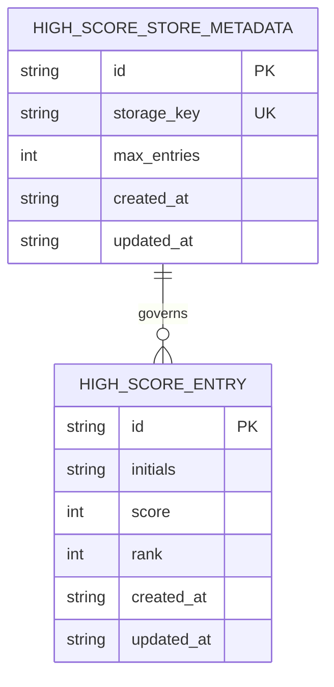

# DBA Mission Report

**Agent**: dba  
**Generated**: 2026-08-17T17:00:39.072Z

---

## Database Engine: None (client-side Web Storage only)

The architecture and tech stack explicitly specify a fully static client-side SPA with no backend service and no database. Persistent state is limited to a top-10 high score list stored in localStorage, so introducing a relational or NoSQL database would contradict the offline-first, zero-backend requirement and add unnecessary complexity. The appropriate persistence mechanism is Web Storage, not a server database.

## Entities (2)

- **high_score_entry**: 6 columns
- **high_score_store_metadata**: 5 columns

## ERD

